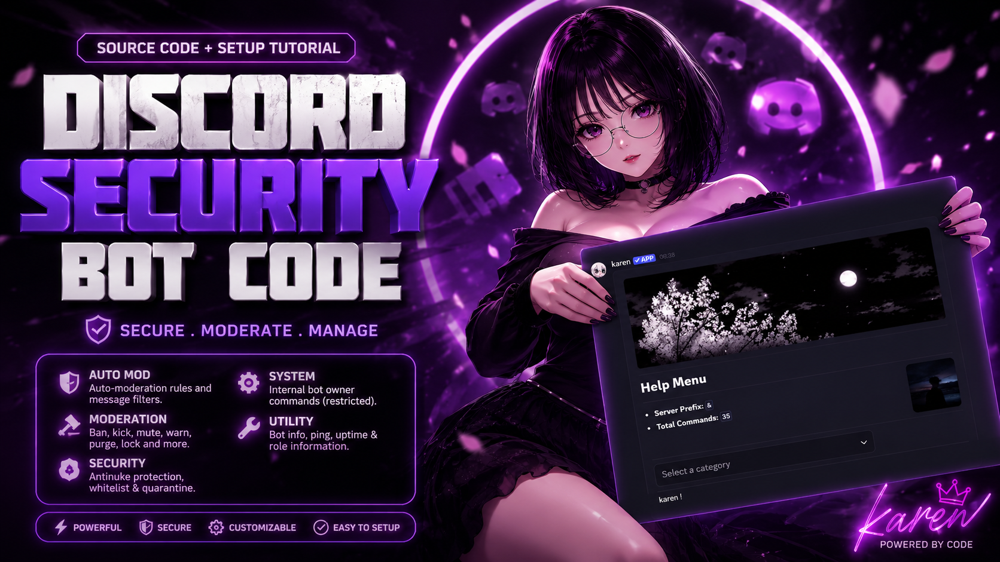

# Karen

Karen is a Discord.js v14 moderation and security bot focused on anti-nuke protection, quarantine handling, role protection, whitelist control, and general moderation utilities.

The bot uses message commands. The default prefix is `&`, and each guild can change it with `&prefix <new_prefix>`.

## Requirements

- Node.js 18 or higher
- MongoDB connection string
- Discord bot token
- Discord bot application with privileged intents enabled
- Bot invited with enough permissions to manage roles, channels, webhooks, bans, kicks, messages, and server settings

For security features, the bot role must stay above every role it needs to manage. If the bot role is too low, Discord will block role edits, quarantine actions, and punishment actions.

## Quick Start

1. Install dependencies.

```bash
npm install
```

2. Copy the example environment file.

```bash
copy .env.example .env
```

On Linux or macOS:

```bash
cp .env.example .env
```

3. Fill `.env`.

```env
TOKEN=your_bot_token
MONGO_DB=your_mongodb_uri
WEBHOOK_URL=your_webhook_url
COOLDOWN=true
BOT_JOIN_CHANNEL=channel_id
BOT_LEAVE_CHANNEL=channel_id
BOT_COMMAND_LOG_CHANNEL=channel_id
OWNERS=owner_id_1,owner_id_2
NP_USERS=owner_id_1,owner_id_2
INVITE_LINK=
BASE_TEXT=```ml\n<> - Required Argument | () - Optional Argument```
```

4. Start the bot.

```bash
npm start
```

## Database

Karen initializes both database layers on startup:

- MongoDB stores antinuke, automod, autorole, whitelist, extra owner, quarantine, and guild security configuration.
- SQLite stores local runtime data such as warnings, snipe data, command usage, and other lightweight records.

If the bot fails at startup, check `MONGO_DB` first. The MongoDB URI must be valid and reachable from the machine running the bot.

## Antinuke Setup

Use this order when setting up a new guild.

1. Move the bot role near the top of the role list.

The bot cannot punish, quarantine, restore, or protect members/roles that are above its highest role.

2. Enable antinuke.

```text
&antinuke enable
```

This creates the unbypass role and stores the guild antinuke config. Do not delete the unbypass role manually. If it is missing, run the repair command.

3. Open the main config panel.

```text
&antinuke config
```

Set the punishment, log channel, and extra owners from the panel. Save the panel when done.

4. Enable the modules you want.

```text
&antinuke modules
```

Select the protection modules from the menu, then confirm the selection. You can also use the enable-all button to turn on every module. After confirmation, the guild cache is reloaded automatically.

5. Set a log channel.

```text
&antinuke logs #channel
```

This is where security actions and important antinuke events should be sent.

6. Add trusted users only when needed.

```text
&extraowner add @user
&whitelist add @user
```

Extra owners can manage antinuke settings. Whitelisted users bypass selected antinuke checks. Keep both lists small.

7. Protect important roles.

```text
&roleprotect add @role
```

Protected roles are watched by the role protection events. If a protected role is edited, the bot tries to restore it. If a protected role is deleted and recreated, the stored protected role id is updated.

8. Run a security scan.

```text
&security scan
```

Use this to find risky admin roles, roles the bot cannot manage, and missing bot permissions.

9. Check the final state.

```text
&antinuke status
```

Confirm that antinuke is enabled, modules are active, the log channel is set, and quarantine/unbypass roles are present.

## Antinuke Commands

| Command | Purpose |
|---|---|
| `&antinuke enable` | Enable antinuke and create the unbypass role |
| `&antinuke disable` | Disable antinuke |
| `&antinuke config` | Open the antinuke configuration panel |
| `&antinuke modules` | Open the module selector |
| `&antinuke status` | Show enabled modules and important config |
| `&antinuke repair` | Rebuild cache and repair missing security roles |
| `&antinuke audit @user` | Check a user's security status and risky permissions |
| `&antinuke logs #channel` | Set the antinuke log channel |
| `&antinuke backup` | Save a security backup of roles and channel overwrites |
| `&antinuke restore` | Restore role permissions and channel overwrites from backup |
| `&antinuke panic enable` | Strip dangerous permissions from roles |
| `&antinuke panic disable` | Disable panic mode and restore saved permissions |
| `&antinuke panic restore` | Restore saved role permissions |

## Security Commands

| Command | Purpose |
|---|---|
| `&security scan` | Scan guild roles and bot permissions for security risks |
| `&roleprotect` | List protected roles |
| `&roleprotect add @role` | Add a role to role protection |
| `&roleprotect remove @role` | Remove a role from role protection |
| `&whitelist` | Manage whitelisted users |
| `&whitelist panel` | Open the whitelist management panel |
| `&extraowner` | Manage extra owners |
| `&extraowner panel` | Open the extra owner management panel |
| `&quarantine` | View quarantine help/list |
| `&quarantine view @user` | Inspect a quarantined user |
| `&quarantineadd @user` | Manually quarantine a user |

## Moderation Helpers

| Command | Purpose |
|---|---|
| `&list admins` | Show members with Administrator permission |
| `&list adminrole` | Show roles with Administrator permission |
| `&inspect user @user` | Inspect a user's permissions and relevant security status |

The inspect command only shows whitelist, extra owner, or quarantine fields when the user actually has that status.

## Protected Modules

The antinuke module selector controls these event groups:

- Ban protection
- Unban protection
- Kick protection
- Bot add protection
- Channel create, delete, and update protection
- Role create, delete, update, add, and remove protection
- Webhook protection
- Server update protection
- Emoji protection
- Sticker protection
- Integration protection
- Thread deletion protection
- Everyone, here, and large role mention protection
- Linked role dangerous permission protection

## Troubleshooting

If antinuke does not react:

- Run `&antinuke status` and confirm antinuke is enabled.
- Run `&antinuke modules` and confirm the needed module is enabled.
- Run `&antinuke repair` to reload guild cache and repair security roles.
- Make sure the bot role is above the target member's highest role.
- Make sure the bot has Administrator or the required Discord permissions.
- Make sure the action was not done by the guild owner, an extra owner, or a whitelisted user.
- Check the configured log channel with `&antinuke status`.

If quarantine does not work:

- Run `&antinuke repair`.
- Check that the quarantine role exists and is below the bot role.
- Make sure channel overwrites can be edited by the bot.

If the bot cannot connect to the database:

- Check that `MONGO_DB` is set in `.env`.
- Confirm the MongoDB URI is reachable.
- Restart the bot after changing `.env`.

## Project Structure

```text
src/
|-- commands/
|   |-- automod/      Auto moderation configuration
|   |-- moderation/   Moderation, list, and inspect commands
|   |-- security/     Antinuke, whitelist, extra owner, quarantine, role protection
|   |-- system/       Owner-only bot management commands
|   `-- utility/      Help, ping, uptime, role info
|-- core/
|   |-- loaders/      Command, event, and database loaders
|   |-- Client.js     Extended Discord.js client
|   |-- Config.js     Environment bindings
|   |-- sentinel.js   Antinuke enforcement engine
|   `-- util.js       Shared helpers
|-- events/           Discord gateway event handlers
|-- handlers/         Command handling and runtime services
|-- models/           Mongoose schemas
`-- index.js          Entry point
```

## License

ISC
